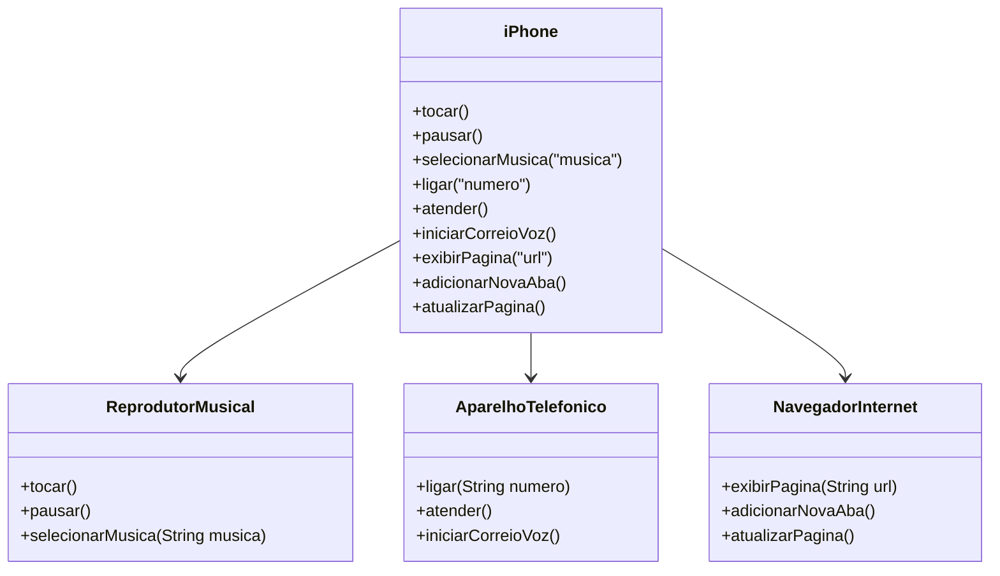

# Desafio DIO - Diagramação de Classes do iPhone
Modelagem e diagramação da representação em UML e Código no que se refere ao componente iPhone.

## 💡 Sobre o Projeto
Utilizando o vídeo de lançamento do iPhone como base, foi produzido uma elaboração de algumas funcionalidades do iPhone utilizando ferramenta de UML para a diagramação das classes e interfaces propostas no desafio.

## ✅ Objetivo do Desafio
Representar as interfaces para:

* Repodutor Musicial: tocar, pausar, selecionarMusica
* Aparelho Telefônico: ligar, atender, iniciarCorrerioVoz
* Navegador na Internet: exibirPagina, adicionarNovaAba, atualizarPagina

## Diagrama UML - Mermaid

## 🔧 Tecnologias Utilizadas

## 📧 Contato

